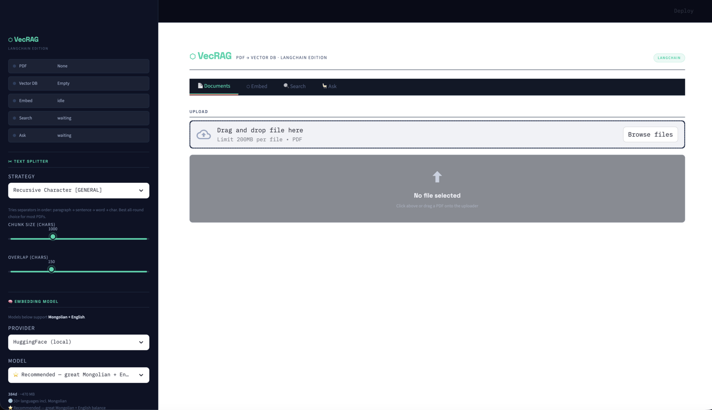

<div align="center">

# ⬡ VecRAG

**PDF → Vector Database · LangChain Edition**

*Load a PDF. Embed it. Search it semantically. Ask questions in any language.*

---



---

[](https://www.python.org/)
[](https://langchain.com/)
[](https://streamlit.io/)
[](https://www.trondatadb.dev/)
[](https://ollama.com/)

</div>

---

## What is VecRAG?

VecRAG is a local **Retrieval-Augmented Generation** workbench. Drop in any PDF, choose an embedding strategy, embed the text into a local ChromaDB vector store, then search or ask questions — all running on your own machine with no cloud API keys required.

Built for **Mongolian and English** documents, with multilingual embedding models selected by default.

---

## Features

| Feature | Details |
|---|---|
| 📄 **PDF Loading** | PyMuPDF + PyPDF fallback, page-by-page preview with page renderer |
| ✂ **6 Chunking Strategies** | Recursive, Semantic, Sentence, Paragraph, Token, Markdown |
| 🔍 **Chunk Preview** | Visual quality bar, per-chunk badges (GOOD / TOO SHORT / TOO LONG) before embedding |
| 🧠 **Multilingual Embeddings** | HuggingFace local models or Ollama — Mongolian + English optimised |
| 💾 **ChromaDB** | Persistent local vector store via LangChain Chroma |
| 🔎 **3 Search Modes** | Semantic similarity, MMR (diverse), Score-threshold |
| 🦙 **LLM QA** | Ask questions answered by any Ollama model (LFM 2.5 Thinking default) |
| ⚡ **Non-blocking UI** | Embed, Search, and Ask all run in background threads — UI never freezes |
| 📊 **Live Logs** | Terminal-style log for every background operation |
| 🌐 **Bilingual** | Mongolian + English prompts, auto-detect answer language |

---

## Screenshots

<table>
<tr>
<td width="50%">

**Documents tab** — upload, page preview, chunk preview with quality analysis

</td>
<td width="50%">

**Embed tab** — live terminal log while embedding runs in background

</td>
</tr>
<tr>
<td width="50%">

**Search tab** — semantic / MMR / threshold search with live log

</td>
<td width="50%">

**Ask tab** — LLM answers with source chunk citations

</td>
</tr>
</table>

> 📁 Put your own screenshots in `images/` and update the table above.

---

## Project Structure

```
vecrag/
├── app.py                    # Entrypoint — sidebar config + tab router
├── requirements.txt
├── images/
│   └── demo.gif              
│
├── .streamlit/
│   └── config.toml           # 500MB upload limit
│
├── core/
│   ├── loader.py             # LangChain PDF loading (PyMuPDF + PyPDF)
│   ├── splitter.py           # 6 LangChain text splitter strategies
│   ├── embedder.py           # HuggingFace / Ollama embedding factories
│   ├── vectorstore.py        # ChromaDB wrapper + background embed/search workers
│   └── chain.py              # LCEL RAG chain + background LLM worker
│
├── panels/
│   ├── documents.py          # Tab 1 — Upload, page viewer, chunk preview
│   ├── embed.py              # Tab 2 — Embed config + live log
│   ├── search.py             # Tab 3 — Vector search + live log
│   └── ask.py                # Tab 4 — LLM QA + source chunks
│
└── ui/
    ├── styles.py             # Navy + teal dark theme CSS
    └── components.py         # Reusable HTML helpers (cards, terminal, stat rows)
```

---

## Quick Start

### 1. Prerequisites

- Python 3.10+
- [Ollama](https://ollama.com/) installed and running

### 2. Clone & install

```bash
git clone https://github.com/tsejavhaa/vecrag.git
cd vecrag

pip install -r requirements.txt
```

### 3. Pull the LLM

```bash
# Default LLM for the Ask tab
ollama pull lfm2.5-thinking

# Optional — better Mongolian quality
ollama pull qwen2.5:3b
```

### 4. Run

```bash
streamlit run app.py
```

Open [http://localhost:8501](http://localhost:8501) in your browser.

---

## Workflow

```
Upload PDF  →  Preview chunks  →  Embed  →  Search  →  Ask
   Tab 1           Tab 1          Tab 2     Tab 3      Tab 4
```

1. **Documents** — Upload your PDF. Browse pages. Click **Run Chunk Preview** to see how your chosen strategy splits the text before committing to a full embed.
2. **Embed** — Press **Embed** and watch the live terminal. Runs in background so the UI stays responsive.
3. **Search** — Type a query. Choose a search mode. Results show with relevance scores and full chunk text.
4. **Ask** — Type a question in Mongolian or English. The LLM reads the top-k retrieved chunks and writes a synthesised answer with citations.

---

## Chunking Strategies

| Strategy | Tag | Best for |
|---|---|---|
| **Recursive Character** | GENERAL | Most PDFs — good default |
| **Semantic** ✦ | BEST QUALITY | Best retrieval quality — splits at topic boundaries |
| **Sentence Transformer Tokens** | TOKEN-AWARE | Never exceeds model context window |
| **Paragraph** | STRUCTURE | Well-formatted PDFs with clear paragraphs |
| **Token (tiktoken)** | LLM-READY | When feeding chunks directly to a GPT-style LLM |
| **Markdown Header** | STRUCTURED | Headed / structured documents |

> **Tip:** Use the Chunk Preview in the Documents tab to compare strategies on your actual document before embedding.

---

## Embedding Models

All models below run locally — no API key needed.

| Model | Dims | Languages | Notes |
|---|---|---|---|
| `paraphrase-multilingual-MiniLM-L12-v2` | 384 | 50+ incl. Mongolian | ⭐ Default — great MN+EN balance |
| `intfloat/multilingual-e5-small` | 384 | 100 | Strong retrieval benchmarks |
| `intfloat/multilingual-e5-base` | 768 | 100 | Best quality — needs more RAM |
| `all-MiniLM-L6-v2` | 384 | English only | Fast fallback for EN-only docs |

You can also use **Ollama embeddings** (`nomic-embed-text`, `mxbai-embed-large`) by switching the provider in the sidebar.

---

## LLM Models (Ask tab)

All models run via [Ollama](https://ollama.com/) — fully local, no internet required after pulling.

| Model | Size | Notes |
|---|---|---|
| `lfm2.5-thinking` | ~2 GB | ⭐ Default — fast reasoning model |
| `qwen2.5:3b` | ~2 GB | Excellent Mongolian / Cyrillic quality |
| `llama3.2:3b` | ~2 GB | Good general Mongolian + English |
| `llama3.2:1b` | ~1 GB | Lightest — CPU-friendly |
| `qwen2.5:7b` | ~5 GB | Best multilingual quality |

Any model in your `ollama list` works — type it directly in the sidebar model field.

---

## Sidebar Status Panel

The sidebar shows live status for every pipeline stage:

```
● PDF          angels_and_demons_mn.pdf
● Vector DB    76 chunks
● Embed        done
● Search       8 results
● Ask          done  4s
```

Dot colours: 🟢 green = OK · 🟡 yellow = warning / changed · 🔵 pulsing = running · ⚫ off = idle

---

## Configuration

All settings live in the sidebar — no config files to edit.

| Section | Settings |
|---|---|
| **Text Splitter** | Strategy, Chunk size (chars), Overlap (chars) |
| **Embedding Model** | Provider (HuggingFace / Ollama), Model, Device (cpu / cuda / mps) |
| **LLM** | Model (any Ollama model), Ollama URL |
| **Storage** | Collection name, Persist directory |

---

## Requirements

```
streamlit>=1.30.0
langchain>=0.3.0
langchain-core>=0.3.0
langchain-text-splitters>=0.2.0
langchain-community>=0.2.0
langchain-huggingface>=0.0.3
langchain-ollama>=0.1.0
langchain-chroma>=0.1.0
langchain-experimental>=0.0.60
chromadb>=0.5.0
sentence-transformers>=3.0.0
pymupdf>=1.23.0
pypdf>=4.0.0
requests>=2.31.0
```

---

## License

MIT — free to use, modify, and distribute.

---

<div align="center">
Built with LangChain · ChromaDB · Streamlit · Ollama
</div>